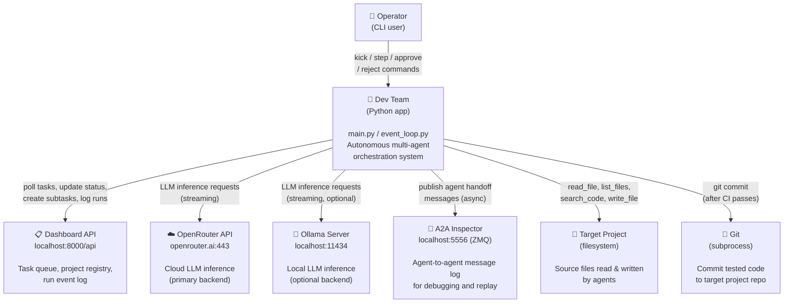

# 03 — System Scope & Context

> **arc42 question**: *What is the system boundary? Who and what does the system communicate with?*
> **C4 level**: Level 1 — System Context

← [[02-constraints]] | Next: [[04-solution-strategy]] →

---

## 3.1 What Is a System Context Diagram?

A C4 Level 1 diagram answers one question: **"What is Dev Team, and what does it talk to?"**. It draws a box around the system and shows all external actors (people and other systems) that interact with it. No internal structure is shown — that comes in [[05-building-blocks]].

Read the diagram as: *arrows show the direction of dependency or data flow*.

---

## 3.2 System Context Diagram

---

## 3.3 External Systems

### Operator (CLI)
- **What**: The human who manages the pipeline via `main.py` CLI commands.
- **Interaction**: `kick <id>` starts a task; `approve/reject <id>` handles human gates; `board` and `status` are read-only monitoring commands.
- **Files**: `main.py` (Click CLI), `orchestrator.py` (board display)
- **Frequency**: Occasional — once set up, the system runs autonomously.

### Dashboard API (`localhost:8000`)
- **What**: A REST API that stores tasks, projects, and run events. It is the **source of truth** for all task state.
- **Interaction**: Dev Team polls every 10 seconds for actionable tasks (`GET /tasks`), updates task status and labels (`PATCH /tasks/{id}`), creates subtasks (`POST /tasks`), and logs run events (`POST /runs`).
- **Protocol**: HTTP/JSON via HTTPX client (`clients/dashboard_client.py`).
- **Key constraint**: Dev Team never stores task state in memory — every poll reads fresh state from this API. See [[02-constraints]] OC-05.

### OpenRouter API (`openrouter.ai:443`)
- **What**: A cloud LLM inference proxy that provides access to dozens of models (Qwen, Llama, Gemma, etc.) via an OpenAI-compatible API.
- **Interaction**: Streaming chat completions with tool calling (`POST /chat/completions`).
- **Authentication**: `OPENROUTER_API_KEY` from `.env`.
- **Fallback**: If the primary model returns HTTP 429 (rate limit), Dev Team transparently switches to the fallback model configured in `models.json`.
- **Files**: `clients/openrouter_client.py`, `core/llm.py`

### Ollama Server (`localhost:11434`)
- **What**: A local LLM server that runs open-source models on the developer's machine.
- **Interaction**: Same OpenAI-compatible streaming API as OpenRouter. Used when `"backend": "ollama"` is set in `models.json`.
- **Status**: Optional — only required if any pipeline step uses the Ollama backend.
- **Files**: `clients/ollama_client.py`

### A2A Inspector (`localhost:5556`)
- **What**: An Agent-to-Agent message gateway for observability. Dev Team publishes structured handoff messages after each agent transition.
- **Interaction**: ZMQ TCP socket (`a2a_server.py`). Non-blocking — failures do not halt the pipeline.
- **Messages**: Stored in `_a2a/messages.jsonl` and can be replayed by an inspector plugin.
- **Files**: `a2a_server.py`, `dtypes.py` (`A2AMessage`)

### Target Project (Filesystem)
- **What**: The Python project that Dev Team is implementing tasks for. Its root path is stored in the Dashboard as `project.root_path`.
- **Interaction**: Agents read source files (`read_file`), list directories (`list_files`), search code (`search_code`), and write skeleton/implementation/test files (`write_file`).
- **Isolation**: All file access is scoped via `project_context(root)` thread-local context manager (`core/tools.py`). Writes are tracked and rolled back on agent failure.
- **Files**: `core/tools.py`, `clients/dashboard_client.py` (`get_project_root()`)

### Git (subprocess)
- **What**: The git CLI, invoked as a subprocess by `TestAgent.run_ci()` after all tests pass.
- **Interaction**: `git add`, `git commit` with an LLM-generated commit message.
- **Outcome**: Produces `CIResult` with `status: "committed"` (success), `"failed"` (tests failed), or `"commit_failed"` (git error).
- **Files**: `agents/tester.py`

---

> Next: [[04-solution-strategy]] explains *how* the system was designed to meet the goals within these constraints.
> For internal structure, see [[05-building-blocks]] (C4 Level 2 + 3).
