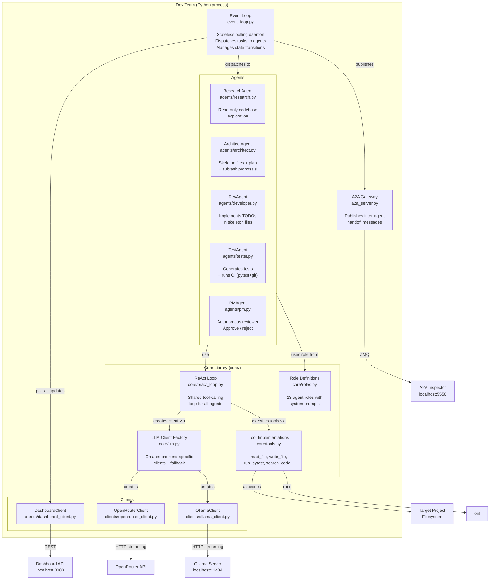
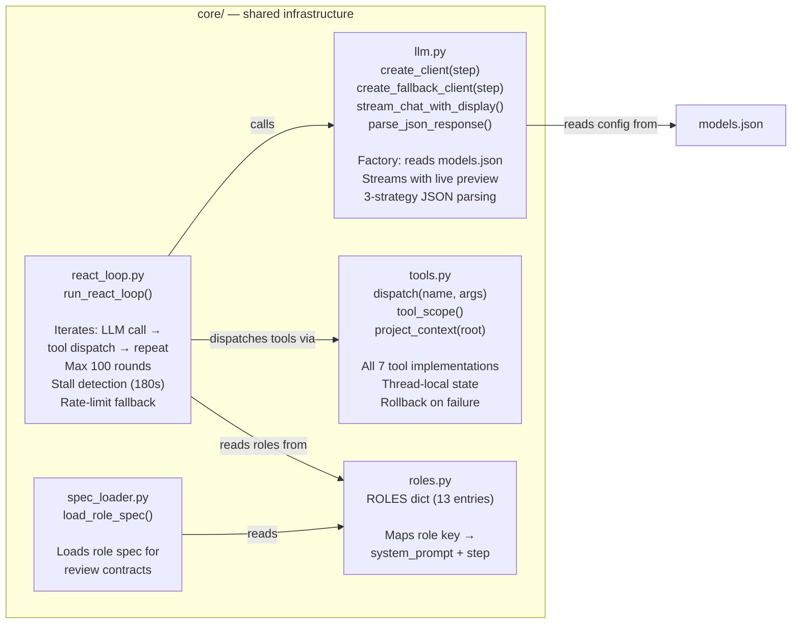

# 05 — Building Block View

> **arc42 question**: *What are the major structural elements and how do they relate?*
> **C4 levels**: Level 2 (Containers) + Level 3 (Components inside `core/`)

← [[04-solution-strategy]] | Next: [[06-runtime-view]] →

---

## 5.1 What Are These Diagrams?

**C4 Level 2 — Container diagram**: zooms into the Dev Team system box from [[03-system-context]] and shows the major runtime units — processes, services, or significant libraries — and how they communicate.

**C4 Level 3 — Component diagram**: zooms into one container (here, the `core/` library) and shows its internal building blocks.

> A *container* in C4 is not a Docker container. It's any deployable unit that runs in its own process space or is a distinct library.

---

## 5.2 Container Diagram (C4 Level 2)

---

## 5.3 Agent Summary Table

| Agent              | File                  | Role key                          | Backend step | Tool set                                                                       | Output model              |
| ------------------ | --------------------- | --------------------------------- | ------------ | ------------------------------------------------------------------------------ | ------------------------- |
| **ResearchAgent**  | `agents/research.py`  | `researcher:explore`              | `researcher` | read_file, list_files, search_code, submit_research                            | `ResearchContext`         |
| **ArchitectAgent** | `agents/architect.py` | `architect:design`                | `architect`  | read_file, list_files, search_code, write_file, finish                         | `ArchitectResult`         |
| **DevAgent**       | `agents/developer.py` | `developer:implement`             | `developer`  | read_file, list_files, search_code, write_file, run_pytest, run_pylint, finish | `DeveloperResult`         |
| **TestAgent**      | `agents/tester.py`    | `tester:unit-tests` + `tester:ci` | `tester`     | read_file, list_files, search_code, write_file, run_pytest, run_pylint, finish | `TestResult` + `CIResult` |
| **PMAgent**        | `agents/pm.py`        | `pm:architect-review` etc.        | `pm`         | *(no tools — single LLM call)*                                                 | `ReviewResult`            |

> Note: ArchitectAgent intentionally **cannot** call `run_pytest` or `run_pylint` — architects design, they don't test. This is enforced via `ARCHITECT_TOOL_SPECS` in `core/tools.py`.

---

## 5.4 Component Diagram — `core/` Library (C4 Level 3)

---

## 5.5 Tool Specifications

Tools are defined as OpenAI-compatible function dicts. Three subsets are used:

| Constant | File | Contents |
|----------|------|---------|
| `TOOL_SPECS` | `core/tools.py` | Full set: read_file, list_files, search_code, write_file, run_pytest, run_pylint, finish |
| `ARCHITECT_TOOL_SPECS` | `core/tools.py` | Excludes run_pytest and run_pylint |
| `RESEARCH_TOOL_SPECS` | `core/tools.py` | Read-only: read_file, list_files, search_code, submit_research |

---

## 5.6 Context Artifact Files

Between pipeline stages, agent output is persisted in `_context/<task_id>/`:

| File | Pydantic model | Written by | Read by |
|------|---------------|-----------|--------|
| `research.json` | `ResearchContext` | ResearchAgent | ArchitectAgent |
| `architect.json` | `ArchitectResult` | ArchitectAgent | PMAgent, Event Loop |
| `skeleton_files.json` | `list[FileContent]` | Event Loop (from architect) | DevAgent |
| `developer.json` | `DeveloperResult` | DevAgent | TestAgent, PMAgent |
| `previous_files.json` | `list[FileContent]` | Event Loop (on retry) | DevAgent |
| `testing.json` | `TestingContext` | TestAgent | PMAgent |
| `feedback.json` | `FeedbackContext` | Event Loop (on rejection) | DevAgent |
| `error.log` | *(plain text)* | Event Loop (on exception) | Operator |

---

> See [[06-runtime-view]] to understand how these containers interact at runtime during a task execution.
> See [[08-crosscutting-concepts]] for the patterns that cut across all containers.
