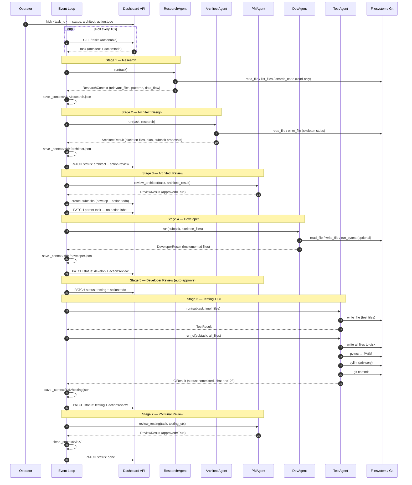
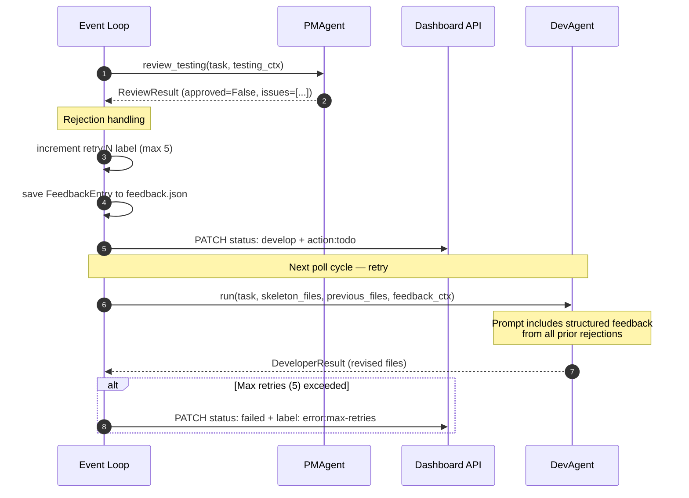
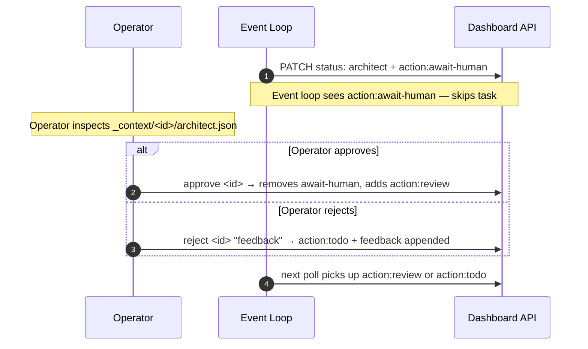
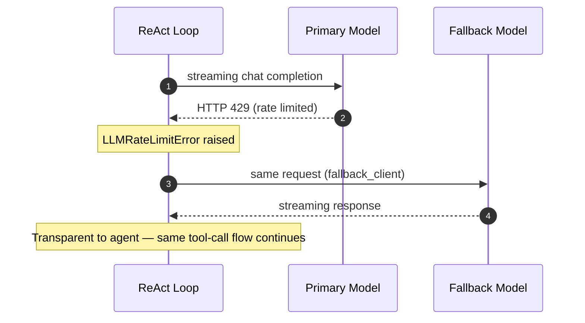

# 06 — Runtime View

> **arc42 question**: *How does the system behave at runtime? What happens when a task runs?*

← [[05-building-blocks]] | Next: [[07-deployment-view]] →

---

Runtime view describes the **dynamic behavior** — who calls whom, in what order, and what data is passed. This complements the static structure in [[05-building-blocks]].

---

## 6.1 Happy Path: Full Task Lifecycle

This is the normal flow for a task that passes all reviews on the first attempt.



---

## 6.2 Retry Loop (PM Rejection)

When PM rejects developer output, the task is reset and retried with structured feedback.



---

## 6.3 CI Iterative Fix Loop

When pytest fails on the first run, TestAgent enters an iterative fix loop (up to 3 rounds).

```mermaid
sequenceDiagram
    autonumber
    participant TA as TestAgent
    participant FS as Filesystem

    TA->>FS: write all files to disk
    TA->>FS: pytest → FAIL (failing test list)

    loop Up to 3 fix rounds
        TA->>TA: ReAct loop to fix failing tests
        Note over TA: Reads failing test names,<br/>edits test or impl file
        TA->>FS: write_file (fixed file)
        TA->>FS: pytest → result
        alt PASS
            TA->>FS: pylint (advisory)
            TA->>FS: git commit
            TA-->>TA: CIResult(status: committed)
            break
        end
    end

    alt Still failing after 3 rounds
        TA-->>TA: CIResult(status: failed, output: pytest output)
    end
```

---

## 6.4 Human Gate Flow (Optional)

When `HUMAN_GATES["architect_output"] = True` in `config.py`, the pipeline pauses after architect review.



---

## 6.5 LLM Rate-Limit Fallback (Inside ReAct Loop)



---

> For the static structure that supports these flows, see [[05-building-blocks]].
> For the patterns that make these flows reliable, see [[08-crosscutting-concepts]].
