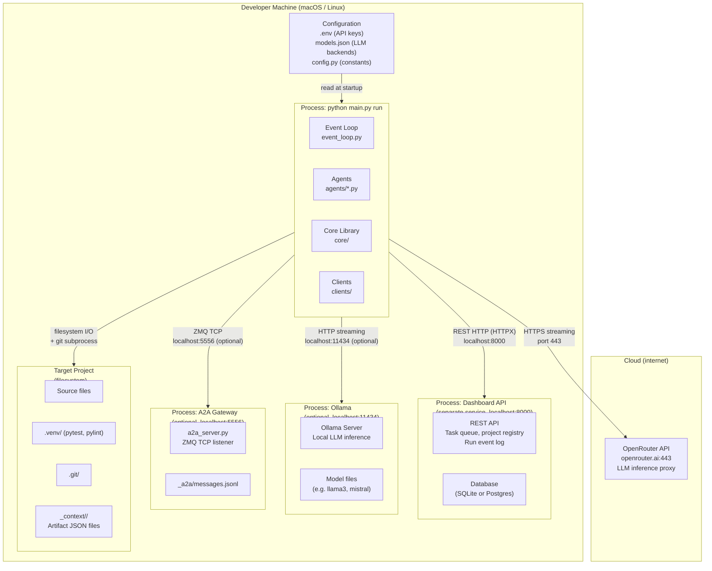

# 07 — Deployment View

> **arc42 question**: *Where does the system run? What infrastructure, processes, and configuration does it need?*

← [[06-runtime-view]] | Next: [[08-crosscutting-concepts]] →

---

## 7.1 Deployment Diagram

Everything runs on a **single developer machine**. No containers, no cloud infrastructure required (except the LLM API calls to OpenRouter).



---

## 7.2 Process Inventory

| Process | How to start | Required? | Port |
|---------|-------------|-----------|------|
| **Dev Team event loop** | `python main.py run` | Yes | — |
| **Dashboard API** | `(separate service)` | Yes | 8000 |
| **Ollama Server** | `ollama serve` | Only if a step uses `"backend": "ollama"` | 11434 |
| **A2A Gateway** | `python a2a_server.py` | No (observability only) | 5556 |

---

## 7.3 Configuration Files

| File | Location | Purpose | Sensitive? |
|------|---------|---------|-----------|
| `.env` | Project root (parent) | `OPENROUTER_API_KEY`, `A2A_HOST`, `A2A_PORT` | **Yes** — never commit |
| `models.json` | `dev_team/` | LLM backend + model per pipeline step | No |
| `config.py` | `dev_team/` | All runtime constants (timeouts, retry limits, poll interval, human gates) | No |

### `.env` format
```
OPENROUTER_API_KEY=sk-or-v1-...
A2A_HOST=127.0.0.1   # optional, default: 127.0.0.1
A2A_PORT=5556         # optional, default: 5556
```

### `models.json` format
```json
{
  "steps": {
    "researcher": {
      "backend": "openrouter",
      "model": "qwen/qwen3-30b-a3b:free",
      "fallback": { "backend": "openrouter", "model": "qwen/qwen3-4b:free" }
    },
    "architect": { ... },
    "pm":        { ... },
    "developer": { ... },
    "tester":    { ... }
  }
}
```

---

## 7.4 Switching LLM Backends

To change the LLM for any pipeline step, edit only `models.json` — no code changes needed.

| Goal | Change in `models.json` |
|------|------------------------|
| Use a different OpenRouter model | Change `"model"` in the relevant step |
| Use a local Ollama model | Set `"backend": "ollama"` and `"model": "llama3"` |
| Use Claude Code SDK (Anthropic) | Set `"backend": "claude-code"` and `"model": "claude-opus-4-6"` |
| Add a fallback model | Add `"fallback": {"backend": "...", "model": "..."}` |

The factory function `create_client(step_name)` in `core/llm.py` reads this config at startup. Invalid backend names or empty model strings cause immediate `SystemExit` (validated by `ModelsConfig` Pydantic model at import time).

---

## 7.5 Target Project Requirements

The target project (the one Dev Team writes code for) must have:

| Requirement | Why |
|------------|-----|
| Python `.venv/` with `pytest` | `TestAgent.run_ci()` resolves `pytest` from `.venv/bin/` via `_find_venv_bin()` |
| Python `.venv/` with `pylint` | Same — `run_pylint()` resolves from `.venv/bin/` |
| Git repository initialized | `git add` + `git commit` run as subprocesses after CI passes |
| `tests/` directory | `run_pytest` runs `pytest tests/ --tb=short -q` |

---

> See [[09-architecture-decisions]] ADR-009 for rationale on keeping backend configuration out of agent code.
