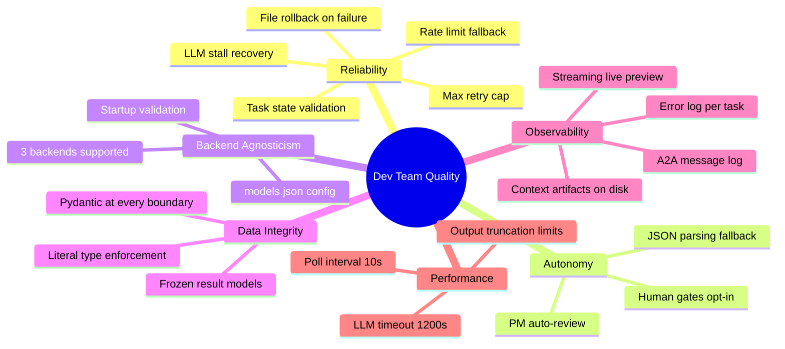

# 10 — Quality Requirements

> **arc42 question**: *How is quality defined for this system? What are the measurable quality scenarios?*

← [[09-architecture-decisions]] | Next: [[11-risks-technical-debt]] →

---

Quality requirements are the non-functional requirements — the "-ilities". In arc42, they are organized as a **quality tree** that maps quality goals (from [[01-introduction-goals]]) to concrete, measurable scenarios.

---

## 10.1 Quality Tree

---

## 10.2 Reliability Scenarios

| ID | Scenario | Expected behavior | Mechanism | Code reference |
|----|---------|-------------------|-----------|---------------|
| R-01 | LLM produces no tokens for 180s | Task retries up to 3 times, then marks failed | `LLMStallError`, `LLM_STALL_MAX_RETRIES` | `core/llm.py` |
| R-02 | Primary model returns HTTP 429 | Request transparently retried with fallback model | `LLMRateLimitError`, fallback client | `core/llm.py` |
| R-03 | Agent hits max rounds (100) without calling `finish()` | Written files are deleted, task increments retry counter | `_rollback_written_files()` | `event_loop.py`, `core/tools.py` |
| R-04 | Task reaches 5 retries | Task marked `failed` with label `error:max-retries` | Retry counter check | `event_loop.py` |
| R-05 | Agent produces invalid context JSON | Error logged, task reset to `action:todo` | `_load_typed_context()` returns `None` on `ValidationError` | `event_loop.py` |
| R-06 | Dashboard API is unreachable | Event loop logs warning, sleeps 10s, retries | Polling loop `try/except` | `event_loop.py` |
| R-07 | Unhandled exception during task | Stack trace saved to `error.log`, task marked `failed` | Top-level `try/except` per task | `event_loop.py` |
| R-08 | Task state transition is invalid | `ValueError` raised with current, attempted, and allowed states | `VALID_TRANSITIONS` dict | `dtypes.py`, `event_loop.py` |

---

## 10.3 Autonomy Scenarios

| ID | Scenario | Expected behavior | Mechanism | Code reference |
|----|---------|-------------------|-----------|---------------|
| A-01 | PM receives architect output | PM reviews and returns `approved=True/False` without human input | `PMAgent.review_architect()` | `agents/pm.py` |
| A-02 | LLM response is not valid JSON | System extracts decision using 3-strategy fallback | `parse_json_response()` | `core/llm.py` |
| A-03 | Human gate is disabled (default) | Pipeline proceeds without waiting for operator | `HUMAN_GATES` all `False` | `config.py` |
| A-04 | All subtasks reach `done` | Parent task is automatically completed | Parent completion check in event loop | `event_loop.py` |

---

## 10.4 Performance Characteristics

| Metric | Value | Config key | File |
|--------|-------|-----------|------|
| Poll interval | 10 seconds | `EVENT_LOOP_POLL_INTERVAL` | `config.py` |
| LLM stall timeout | 1200 seconds (20 min) | `LLM_STALL_TIMEOUT` | `config.py` |
| Ollama request timeout | 1200 seconds | `OLLAMA_TIMEOUT` | `config.py` |
| Max ReAct rounds per task | 100 | `MAX_TOOL_ROUNDS` | `config.py` |
| Max task retries | 5 | `MAX_TASK_RETRIES` | `config.py` |
| File read truncation | 100,000 characters | hardcoded | `core/tools.py` |
| Directory listing limit | 60 matches | hardcoded | `core/tools.py` |
| Code search limit | 30 matches | hardcoded | `core/tools.py` |
| Streaming preview | 10 lines rendered live | `preview_lines=10` | `core/llm.py` |
| CI fix rounds | 3 rounds max | `_MAX_FIX_ROUNDS` | `agents/tester.py` |

---

## 10.5 Data Integrity Scenarios

| ID | Scenario | Expected behavior | Mechanism | Code reference |
|----|---------|-------------------|-----------|---------------|
| D-01 | Agent produces output with missing required field | Validation error logged, task reset | `model_validate()` on load | `event_loop.py` |
| D-02 | `CIStatus` value is outside the Literal set | Pydantic rejects at construction | `CIStatus = Literal[...]` | `dtypes.py` |
| D-03 | Agent result mutated after construction | `FrozenInstanceError` raised | `ConfigDict(frozen=True)` | `dtypes.py` |
| D-04 | Dashboard PATCH omits a field | Missing field is fetched and re-included before PATCH | Full fetch before update | `clients/dashboard_client.py` |
| D-05 | `models.json` has invalid backend name | Process exits immediately at startup | `ModelsConfig` validation | `config.py` |

---

## 10.6 Observability Scenarios

| ID | Scenario | What is available | Mechanism |
|----|---------|-------------------|-----------|
| O-01 | Task fails after 3 retries | Stack trace in `_context/<id>/error.log` | `_save_error_log()` in `event_loop.py` |
| O-02 | Operator wants to see what architect produced | `_context/<id>/architect.json` with skeleton files and plan | Context artifact persistence |
| O-03 | Operator wants to replay agent handoffs | `_a2a/messages.jsonl` with all A2A messages | A2A gateway |
| O-04 | Live monitoring during task execution | Streaming preview in terminal (first 10 lines per chunk) | `stream_chat_with_display()` |
| O-05 | Operator wants task board overview | `python main.py board` — rich table of all tasks | `orchestrator.py` |

---

> See [[11-risks-technical-debt]] for where these quality goals are at risk.
> See [[08-crosscutting-concepts]] for the implementation patterns behind these scenarios.
